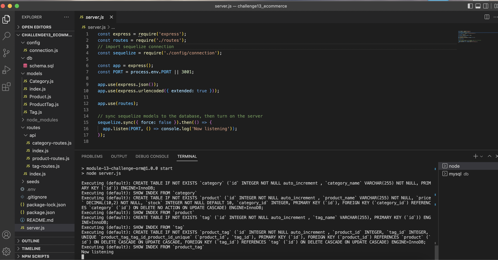
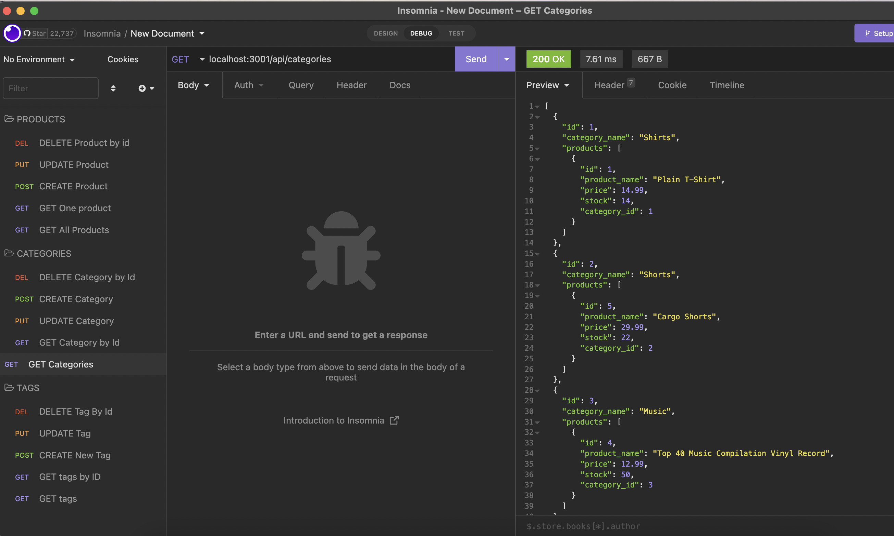
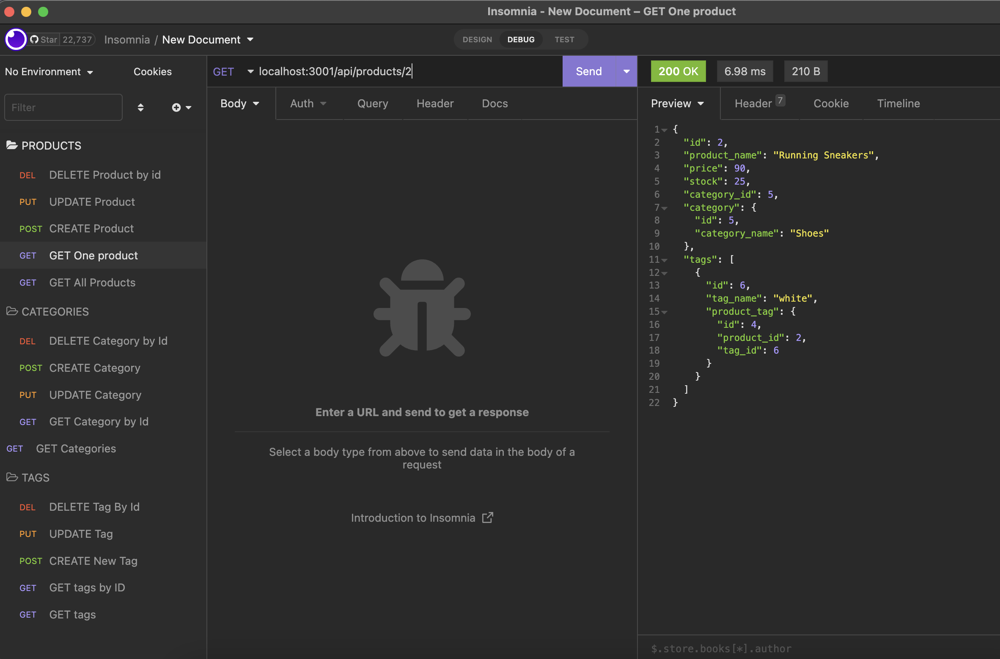
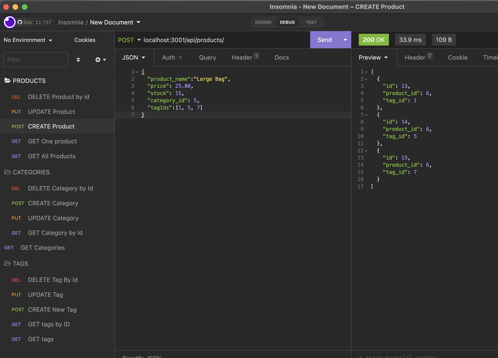
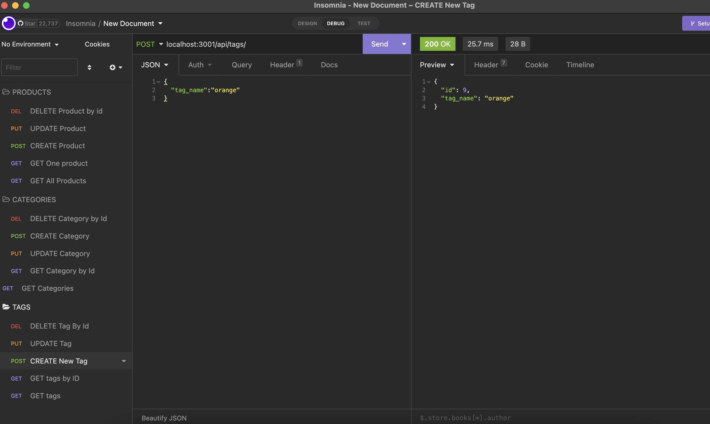
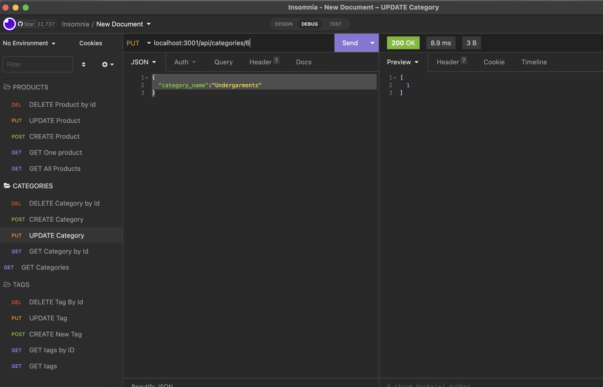
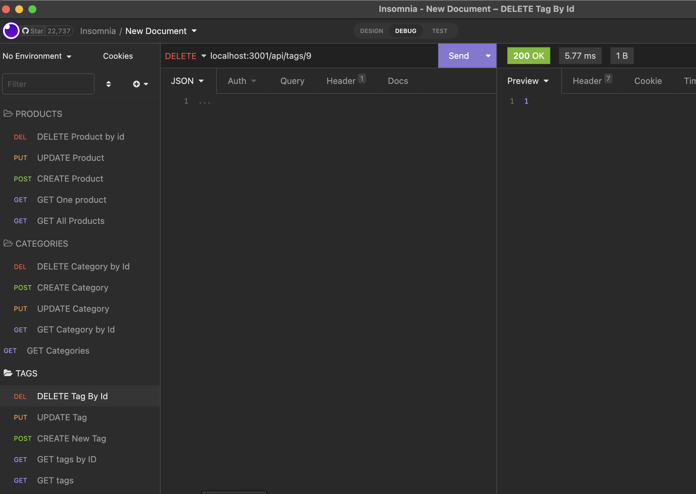

# Module 13: Object-Relational Mapping (ORM) Challenge: E-commerce Back End

Using Express.js, Sequelize, and MySQL database, the backend for an e-commerce site will be built.
Link to [Application Functionality Video]:(https://youtu.be/tV_SDL18bpg)

This walkthrough video show the POST, PUT, and DELETE routes for products and tags being tested in Insomnia Core.

# User Story for E-Commerce Back End

A manager at an internet retail company WANT a back end for my e-commerce website that uses the latest technologies
SO THAT their company can compete with other e-commerce companies.

The developer will create an application that will fulfill these criteria.

**Technologies Used: Express.js, Node.js, npm, MySQL**.
- MySQL2 and Sequelize package will be needed to connect to MySQL database and perform queries.
- Sequelize packages connect your Express.js API to a MySQL database
- dotenv package use environment variables to store sensitive data, like your MySQL username, password, and database name.

The following video shows an example of the backend working  and using Insomnia to show the database api routes functioning: (https://youtu.be/tV_SDL18bpg)

## Criteria

Create a back end for e-commerce website that fulfill these criteria: 

There is a **functional Express.js API**.

WHEN the **user add the database name, MySQL username, and MySQL password to an environment variable file**,
THEN  the user is able to **connect to a database using Sequelize.**

WHEN **the user enter schema and seed commands**,
THEN a **development database is created and is seeded with test data.**

WHEN  **the user enter the command to invoke the application**,
THEN  **the server is started and the Sequelize models are synced to the MySQL database.**

WHEN **the user open API GET routes in Insomnia Core for categories, products, or tags,**
THEN **the data for each of these routes is displayed in a formatted JSON.**

WHEN **the user test API POST, PUT, and DELETE routes in Insomnia Core,**
THEN **the user is able to successfully create, update, and delete data in my database.**

## Installation
**You will need to run to have access to MySQL Server and login info.**

You will need to have Express.js /Node.js installed on your computer.
You will need to clone the starter code from the project repository.
You will need to make sure you are in the main directory of the project folder.
You will need to create an .env file in the directory.

You will need to install npm packages.

run command in main directory:

- npm init
- npm i

run command in the db/schema.sql directory:

- mysql -u root -p (with your own login credentials**)
- source schema.sql

run command in main directory:
- npm run seed 
- npm start

### Assets
These are images of the working backend functionalities and databases queries tested with Insomnia: GET, POST, PUT, and DELETE for categories, products, and tags.

#### Links
[Github Repository](https://github.com/pppreap/challenge13_ecommerce) 
///
[Link to  Functionality Video](https://youtu.be/tV_SDL18bpg)

#### License/ Credits
Starter Code, User Story, and Criteria from Michigan State University Boot Camp.